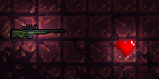
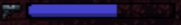

# ExitTheGungeon

Exit the gungeon is a 2D top-down arena shooter made with Unity. This is a project I did on my own for a midterm exam at my university. The goal of the game is really simple : stay alive as long as possible. If you just want to try the game, you can download a build version [here](https://drive.google.com/file/d/1PKLOimRciD57A-SzJOuoV2dLF_iC_F2M/view?usp=sharing).

## Game rules

When you are in game, a random number of enemies will spawn randomly on the map and they will try to attack you. You have to kill them before they do. Enemies respawn at random intervals. When you kill an ennemy with your weapon, there is a random chance that he drops an item. This item could either be an `heart` that heals you when you pick it up, or a new weapon.

Currently, they are only two weapons dropable in the game : an `AK-47` with high fire rate and an `AWP sniper` with low fire rate but high dommage. These weapons have a limited time of use wich start when you pick them up. This timer is visible in the game HUD.

## Controls

You can use either `WASD` or `ZQSD` (french keyboard) to move arround.
You can use the `SPACE` bar to perform a roll towards the cursor. Finaly, you can aim with the `MOUSE` and use the `LEFT MOUSE` click to shoot with the weapon currently equipped. If you want to pick a weapon on the ground, just run on it !

## ToDo

Here is a few things that still need to be implemented or fixed :

- Add a settings menu
- Implement more weapons / ennemies
- Add a level selection menu
- Fix collision between the player and enemies